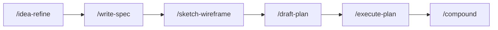

# 퀀트 포트폴리오 최적화

큐레이션된 주식 번들에서 최적 포트폴리오 가중치를 계산하는 웹 앱.
효율적 프론티어 시뮬레이션, 백테스팅, 결과 저장·비교까지 지원합니다.

## 주요 기능

- **번들 선택**: 테마형·팩터형·전통 배분 등 큐레이션 번들 + 직접 번들 추가
- **최적화**: Max Sharpe / Min Variance / Risk Parity 3가지 전략
- **효율적 프론티어**: 10,000개 시뮬레이션 포인트 + 최적 가중치 강조
- **백테스팅**: 최적 포트폴리오 vs Buy & Hold 누적 수익률 비교, 요약 메트릭
- **결과 저장·비교**: 로컬 저장 후 두 결과를 나란히 비교
- **사용자 번들**: 직접 종목을 구성해 번들로 저장·삭제

## 기술 스택

| 범주 | 라이브러리 |
|---|---|
| Framework | Next.js 16 (App Router, Turbopack) |
| UI | React 19, Tailwind CSS 4, shadcn/ui, Radix UI |
| 차트 | Recharts (ResponsiveContainer 필수) |
| 데이터 | Yahoo Finance API (adjclose 기반) |
| 상태 | localStorage (결과·사용자 번들) |
| 테스트 | Vitest + Testing Library, Playwright |
| 패키지 | Bun |

## 시작하기

```bash
bun install
bun dev
```

[http://localhost:3000](http://localhost:3000)에서 확인할 수 있습니다.

E2E 테스트 최초 실행 전 Chromium 설치:

```bash
bunx playwright install chromium
```

## 스크립트

| 명령어 | 설명 |
|---|---|
| `bun dev` | 개발 서버 실행 |
| `bun run build` | 프로덕션 빌드 |
| `bun run test` | Vitest 실행 |
| `bun run test:watch` | Vitest 워치 모드 |
| `bun run test:e2e` | Playwright E2E 실행 |
| `bun run lint` | ESLint 실행 |

## 아키텍처

```
types/ → config/ → lib/ → services/ → hooks/ → components/ → app/
```

역방향 의존 금지. `lib/`에 Yahoo Finance API 클라이언트·최적화 계산·localStorage 유틸이 위치합니다.

### 주요 파일

| 경로 | 역할 |
|---|---|
| `app/api/prices/route.ts` | Yahoo Finance 프록시 (adjclose, 10s 타임아웃) |
| `lib/optimization.ts` | 포트폴리오 최적화 (Sharpe·분산·리스크패리티) |
| `lib/custom-bundles.ts` | 사용자 번들 CRUD (localStorage) |
| `lib/storage.ts` | 결과 저장·불러오기 (localStorage) |
| `hooks/useOptimization.ts` | 최적화 실행 상태 머신 |
| `components/gallery/` | 번들 갤러리·카드 |
| `components/results/` | 효율적 프론티어·파이차트·백테스팅 |

## 개발 워크플로우

Spec-Driven Development: `/write-spec` → `/draft-plan` → `/execute-plan` → `/compound`



`artifacts/<feature>/spec.md`가 각 feature의 **단일 불변 계약**입니다. spec.md의 Success Criteria에서 테스트를 파생하고, 구현이 spec.md와 맞지 않으면 구현을 수정합니다.

각 단계는 human review gate를 가집니다. 현재 단계가 검증되기 전에는 다음 단계로 넘어가지 않습니다.

### 1. Ideate (`/idea-refine`)

날것의 아이디어를 구조화된 확산적/수렴적 사고로 다듬어, 만들 가치가 있는 행동 가능한 개념으로 정리합니다. 산출물은 `artifacts/<feature>/idea.md`입니다 (선택).

### 2. Specify (`/write-spec`)

사용자와 대화하며 feature의 스펙을 작성합니다. 사용자 흐름을 시뮬레이션하고 빈칸을 질문으로 채운 뒤, scope/scenarios/invariants를 담은 `artifacts/<feature>/spec.md`를 생성합니다. WHAT만 기술하며 구현 결정(파일 경로, 라이브러리 등)은 포함하지 않습니다.

### 3. Sketch (`/sketch-wireframe`)

spec.md 기반 HTML 와이어프레임을 생성합니다. 레이아웃 검증이 목적이며, 피드백 루프를 돌려 `artifacts/<feature>/wireframe.html`에 저장합니다. UI가 포함되지 않은 feature에서는 건너뜁니다.

### 4. Plan (`/draft-plan`)

spec.md와 wireframe을 참조해 구현 계획을 수립합니다. vertical slicing과 의존성 순서로 TDD 기반 Task 목록을 생성하며, 각 Task의 Acceptance는 spec.md의 Success Criteria에 1:1 매핑됩니다. 산출물은 `artifacts/<feature>/plan.md`입니다.

### 5. Build (`/execute-plan`)

plan.md의 Task를 한 번에 하나씩 직접 구현합니다. TDD (RED → GREEN) 규율을 따르고, Task당 conventional commit 하나를 만듭니다. 완료 후 사용자에게 spec.md 대비 검증을 요청하며, 판단은 `artifacts/<feature>/learnings.md`에 기록합니다.

### 6. Compound (`/compound`)

`learnings.md`에 누적된 판단을 읽어 반복된 패턴을 감지하고, Skill/Hook/Rule/CLAUDE.md로 승격할 후보를 제안합니다. 사용자 승인 후에만 적용합니다.

## 테스트 파일 컨벤션

| 파일 패턴 | 용도 |
|---|---|
| `*.test.tsx` / `*.test.ts` | 단위·통합·수용 기준 테스트 (Vitest, colocated) |
| `*.spec.ts` | E2E 테스트 (Playwright, `e2e/`) |

자세한 테스팅 원칙과 Stack은 [CLAUDE.md → Testing](./CLAUDE.md#testing)을 참조합니다.

## Hooks

Claude Code hooks 기반 자동 품질 게이트 (`.claude/settings.json`)

| 단계 | 트리거 | 동작 |
|---|---|---|
| WorktreeCreate | 워크트리 생성 | `worktree-create.sh` — main 동기화, `.env` 복사, 의존성 설치 |
| PostToolUse | `Write\|Edit` | `lint-fix.sh` — ESLint auto-fix |
